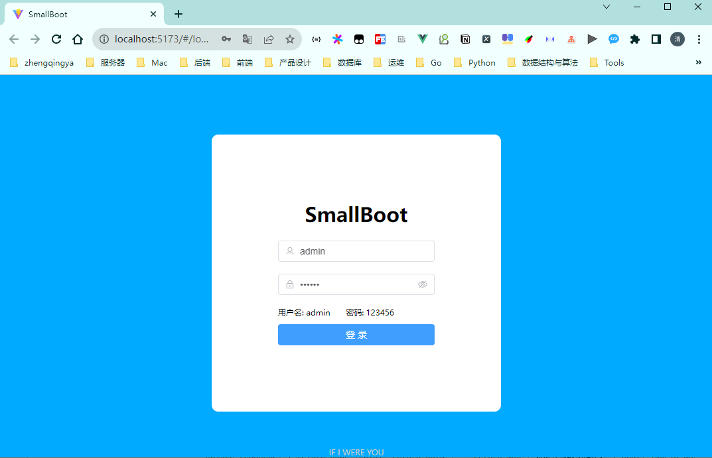
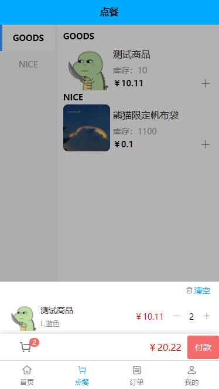

### 一、前言

> 项目地址：[https://gitee.com/zhengqingya/smallboot](https://gitee.com/zhengqingya/smallboot)

> 微服务版本：https://gitee.com/zhengqingya/small-tools

`SmallBoot`：Vue+SpringBoot 前后端分离的项目快速开发脚手架 & 多微信公众号管理平台 & 商城

后端技术栈：

1. SpringBoot2.7.0
2. MySQL5.7
3. MyBatis-Plus3.5.2
4. Redis6.0.8
5. Docker

前端技术栈：

1. Vue3
2. Vite4
3. Pinia
4. Vue Router
5. Element Plus

### 二、运行

> 运行视频见 https://www.bilibili.com/video/BV18G4y1P7Nd

- 前端项目说明&运行见 [`small-web/README.md`](small-web/README.md)
- 后端项目说明&运行见 [`smallboot-api/README.md`](smallboot-api/README.md)
- app项目说明&运行见 [`small-app/README.md`](small-app/README.md)

### 三、页面截图

---

> 学习总是在一点一滴中积累而成的，就像砌砖，总要结结实实。
> 踏踏实实的学吧！加油！成功属于努力的人！
> 🤖 希望你不只是关注+收藏！ 🤖
