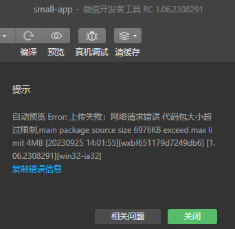
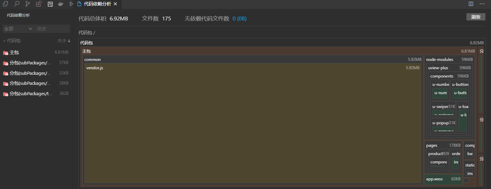
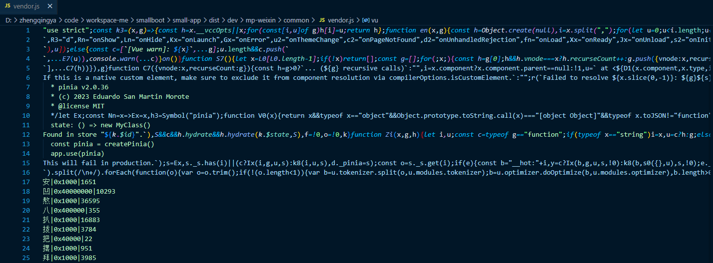

# 代码包超过限制

查看代码依赖分析

发现是`vendor.js`体积过大

### vendor.js 过大的处理方式

> https://uniapp.dcloud.net.cn/matter.html#vendor-js-%E8%BF%87%E5%A4%A7%E7%9A%84%E5%A4%84%E7%90%86%E6%96%B9%E5%BC%8F
> https://uniapp.dcloud.net.cn/collocation/vite-config.html ( cli 创建的项目可以在package.json中添加参数`--minify` )

但我这里通过打开文件查看，发现莫名其妙多了很多文字...

