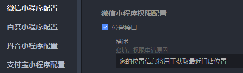
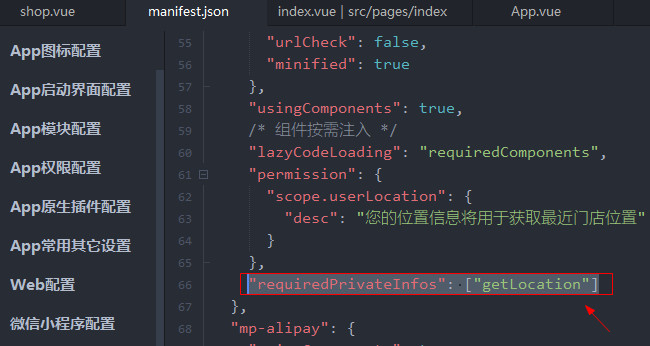

# uni.getLocation获取当前定位

```
function test() {
  uni.getLocation({
    type: 'gcj02', // 返回可以用于uni.openLocation的经纬度
    isHighAccuracy: true, // 开启高精度定位
    success: function (res) {
      console.log('ok：', res);
      const latitude = res.latitude;
      const longitude = res.longitude;

      // 使用应用内置地图查看位置
      uni.openLocation({
        latitude: latitude,
        longitude: longitude,
        success: function () {
          console.log('success');
        },
      });
    },
    fail: function (err) {
      console.log('异常：', err);
    },
  });
}
```

###### 解决uniapp在微信小程序中调用`uni.getLocation`无效问题

> https://developers.weixin.qq.com/miniprogram/dev/api/location/wx.getLocation.html

#### 1、[manifest.json](../../src/manifest.json)



#### 2、`"requiredPrivateInfos": ["getLocation"]` 解決 `getLocation:fail the api need to be declared in the requiredPrivateInfos field in app.json/ext.json`



然后就可以正常使用了。


> tips: 微信开发者工具中定位会有偏移，建议预览到手机中查看
