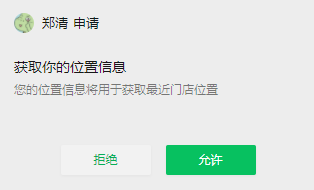

# 引入腾讯地图

### 一、下载微信小程序JavaScriptSDK

https://lbs.qq.com/miniProgram/jsSdk/jsSdkGuide/jsSdkOverview


### 二、使用

通过如下方式导入

```
import QQMapWX from '@/utils/qqmap-wx-jssdk.min.js';
```

会报错： `vue.runtime.esm.js:1442 SyntaxError: The requested module '/src/utils/qqmap-wx-jssdk.min.js' does not provide an export named 'default'`

解决：修改`qqmap-wx-jssdk.min.js`最后一行代码 `module.exports = QQMapWX;` => `export default QQMapWX;`

然后就可以去调用sdk了...

```
let qqmapsdk = new QQMapWX({
   key: '填写自己的key',
});
console.log(qqmapsdk);
```

### 三、解决uniapp在微信小程序中调用`uni.getLocation`无效问题

> https://developers.weixin.qq.com/miniprogram/dev/api/location/wx.getLocation.html

```
function test() {
  uni.getLocation({
    type: 'gcj02', // 返回可以用于uni.openLocation的经纬度
    isHighAccuracy: true, // 开启高精度定位
    success: function (res) {
      console.log('ok：', res);
      const latitude = res.latitude;
      const longitude = res.longitude;

      // 使用应用内置地图查看位置
      uni.openLocation({
        latitude: latitude,
        longitude: longitude,
        success: function () {
          console.log('success');
        },
      });
    },
    fail: function (err) {
      console.log('异常：', err);
    },
  });
}
```

#### 1、[manifest.json](../../src/manifest.json)


#### 2、`"requiredPrivateInfos": ["getLocation"]` 解決 `getLocation:fail the api need to be declared in the requiredPrivateInfos field in app.json/ext.json`


然后就可以正常使用了。


```

```

### 获取IP定位
