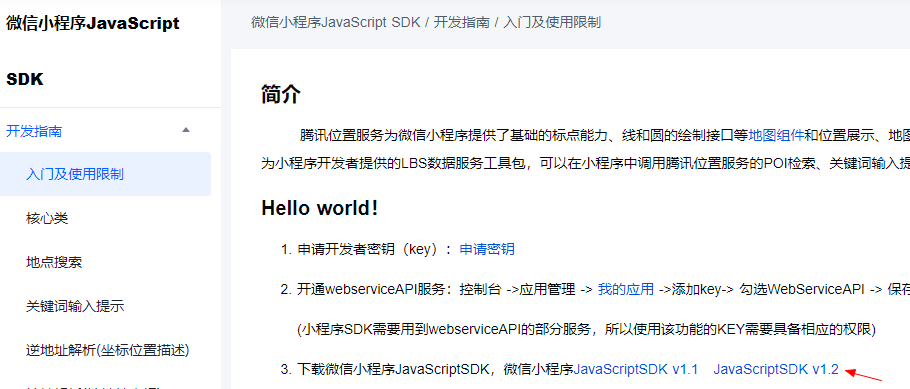

# 引入腾讯地图

微信小程序配置 https://lbs.qq.com/service/webService/webServiceGuide/miniprogram

### 一、下载微信小程序JavaScriptSDK

https://lbs.qq.com/miniProgram/jsSdk/jsSdkGuide/jsSdkOverview



### 二、使用

通过如下方式导入

```
import QQMapWX from '@/utils/qqmap-wx-jssdk.min.js';
```

会报错： `vue.runtime.esm.js:1442 SyntaxError: The requested module '/src/utils/qqmap-wx-jssdk.min.js' does not provide an export named 'default'`

解决：修改`qqmap-wx-jssdk.min.js`最后一行代码 `module.exports = QQMapWX;` => `export default QQMapWX;`

然后就可以去调用sdk了...

```
let qqmapsdk = new QQMapWX({
   key: '填写自己的key',
});
console.log(qqmapsdk);
```

eg:

```
import QQMapWX from '@/utils/qqmap-wx-jssdk.min.js';

qqmapsdkSearch: (keyword) => {
    const { proxy } = getCurrentInstance();
    let { lbs_qq_key } = toRefs(proxy.$store.system.useSystemStore());
    // 实例化API核心类
    let qqmapsdk = new QQMapWX({
      key: lbs_qq_key.value,
    });
    // 调用接口
    qqmapsdk.search({
      keyword: keyword,
      success: function (res) {
        console.log(res);
      },
      fail: function (res) {
        console.log(res);
      },
      complete: function (res) {
        console.log(res);
      },
    });
},
```


