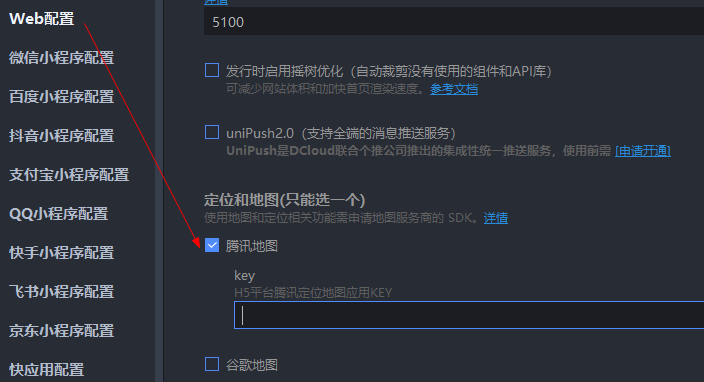
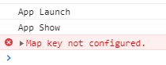
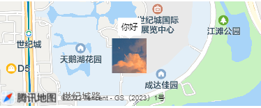

# 地图标点

> https://uniapp.dcloud.net.cn/component/map.html#

### 一、配置地图 key

> tips: 预览到微信小程序时不需要此配置

[manifest.json](../../src/manifest.json)



若未配置，控制台会报 `Map key not configured.`



### 二、代码示例

```
<map
    style="width: 100%; height: 300rpx"
    latitude="30.55273"
    longitude="104.07511"
    scale="15"
    :markers="[
        {
            id: 1,
            latitude: 30.55273,
            longitude: 104.07511,
            iconPath: 'http://127.0.0.1:886/2023-09-11/1701130377848147968-美图35.jpg',
            width: 50,
            height: 50,
            callout: {
                    display: 'ALWAYS',
                    content: '你好',
                    borderRadius: 2,
                    padding: 5,
            },
        },
]"></map>
```

效果

