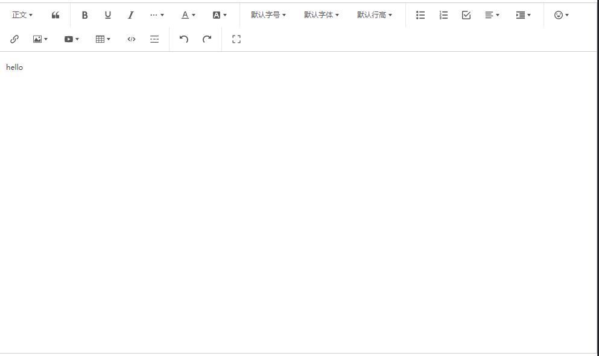

# wangEditor富文本编辑器

- https://github.com/wangeditor-team/wangEditor
- https://www.wangeditor.com/

### 一、安装

```shell
cnpm install @wangeditor/editor --save

cnpm install @wangeditor/editor-for-vue@next --save
```

### 二、使用

#### [BaseEditor.vue](../src/components/Base/BaseEditor.vue)

```
<template>
  <div style="border: 1px solid #ccc">
    <Toolbar style="border-bottom: 1px solid #ccc" :editor="editorRef" :default-config="toolbarConfig" :mode="mode" />
    <Editor v-bind="$attrs" style="height: 500px; overflow-y: hidden" :default-config="editorConfig" :mode="mode" @onCreated="handleCreated" />
  </div>
</template>

<script setup>
const { proxy } = getCurrentInstance();
import '@wangeditor/editor/dist/css/style.css'; // 引入 css
import { onBeforeUnmount, ref, shallowRef, onMounted } from 'vue';
import { Editor, Toolbar } from '@wangeditor/editor-for-vue';

// 编辑器实例，必须用 shallowRef
const editorRef = shallowRef();

let mode = ref('default'); // 'default' 或 'simple'

onMounted(() => {});

const toolbarConfig = {};
const editorConfig = { placeholder: '请输入内容...' };

// 组件销毁时，也及时销毁编辑器
onBeforeUnmount(() => {
  const editor = editorRef.value;
  if (editor == null) return;
  editor.destroy();
});

const handleCreated = (editor) => {
  editorRef.value = editor; // 记录 editor 实例，重要！
};
</script>
<style lang="scss" scoped></style>
```

#### 测试

```
<template>
  <base-Editor v-model="valueHtml" />
</template>

<script setup>
const { proxy } = getCurrentInstance();
let valueHtml = ref('<p>hello</p>');
</script>
<style lang="scss" scoped></style>
```




