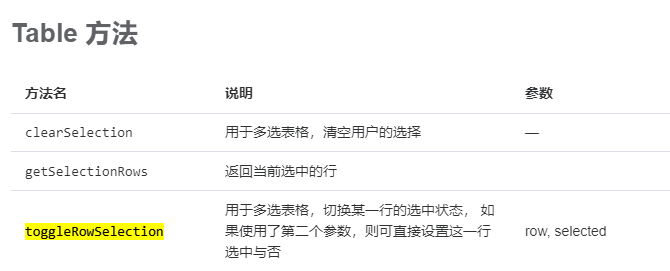

# el-table表格选中行和回显行

> https://element-plus.org/zh-CN/component/table.html#table-%E6%96%B9%E6%B3%95

选中行`selection`

```
<el-table ref="baseTableRef" row-key="id" border :selection="true" :reserve-selection="true" :data="dataList">
    <el-table-column type="selection" width="55"></el-table-column>
    <el-table-column label="名称" prop="name" align="center" />
</el-table>
```

回显选中行

```
function init(){
 nextTick(() => {
    let row = dataList[0];
    proxy.$refs.baseTableRef.toggleRowSelection(row, true);
  });
}
```



拿到当前选中的行数据列表

```
proxy.$refs.baseScopeTableRef.getSelectionRows()
```
