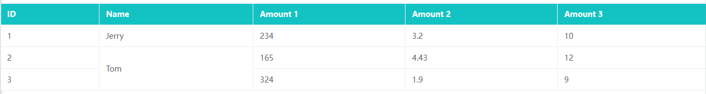

# el-table表格合并行



```
<template>
  <div>
    <el-table :header-cell-style="{ background: '#13C3C3', color: '#fff' }" :data="tableData" :span-method="objectSpanMethod" border style="width: 100%; margin-top: 20px">
      <el-table-column prop="id" label="ID" width="180" />
      <el-table-column prop="name" label="Name" />
      <el-table-column prop="amount1" label="Amount 1" />
      <el-table-column prop="amount2" label="Amount 2" />
      <el-table-column prop="amount3" label="Amount 3" />
    </el-table>
  </div>
</template>

<script setup>
const objectSpanMethod = ({ row, column, rowIndex, columnIndex }) => {
  // 前提数据先要根据 name 排序
  // 需要合并哪一列，0=第一列，1=第二列，……
  if (columnIndex === 1) {
    // 获取当前行的 name ，这里看自己的需要，改成根据哪个去判断
    let currentGoodId = row.name;
    // 获取当前 name 相同的有多少行
    let rowCount = tableData.filter((item) => item.name === currentGoodId).length;
    // 获取当前 name 在表格数据中的第一条数据索引
    let currentRowIndex = tableData.findIndex((item) => item.name === currentGoodId);
    // 判断当前行是否第一行
    let isFirstCell = rowIndex === currentRowIndex;
    // 判断当前行是否最后一行
    let isLastCell = rowIndex === currentRowIndex + rowCount;
    // 如果是第一行，则显示这一行
    if (isFirstCell) {
      return {
        rowspan: rowCount,
        colspan: 1,
      };
      // 否则隐藏这一行
    } else if (!isFirstCell && !isLastCell) {
      return {
        rowspan: 0,
        colspan: 0,
      };
    }
  }
};

const tableData = [
  {
    id: '1',
    name: 'Jerry',
    amount1: '234',
    amount2: '3.2',
    amount3: 10,
  },
  {
    id: '2',
    name: 'Tom',
    amount1: '165',
    amount2: '4.43',
    amount3: 12,
  },
  {
    id: '3',
    name: 'Tom',
    amount1: '324',
    amount2: '1.9',
    amount3: 9,
  },
];
</script>
```