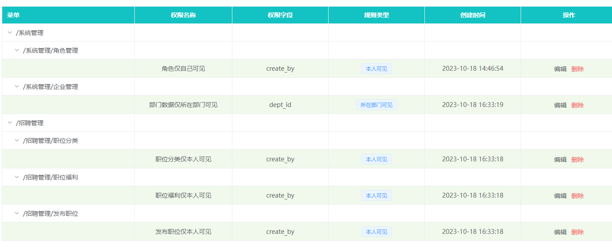

# el-table行样式失效问题



```
<el-table :row-class-name="tableRowClassName" >
  ...
</el-table>
```

```
function tableRowClassName({ row, rowIndex }) {
  if (row.children.length === 0) {
    return 'success-row';
  }
  return '';
}
```

失效问题：`scoped`
解决：去掉`scoped`

```
<style lang="scss" scoped>
.el-table .warning-row {
  --el-table-tr-bg-color: var(--el-color-warning-light-9);
}
.el-table .success-row {
  --el-table-tr-bg-color: var(--el-color-success-light-9);
}
</style>
```
