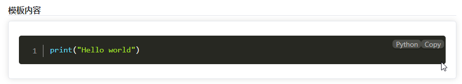

# 代码高亮

通过 `prism.js` 实现代码高亮 https://prismjs.com

### 1、安装依赖

```shell
cnpm i prismjs -S
cnpm install vite-plugin-prismjs -D
```

### 2、配置 `vite.config.js`

```
import { prismjsPlugin } from 'vite-plugin-prismjs';

export default defineConfig({
	plugins: [
	    // 代码高亮编辑器
	    prismjsPlugin({
        languages: 'all', // 语言
        plugins: ['line-numbers', 'show-language', 'copy-to-clipboard', 'inline-color'],
        theme: 'okaidia', // 主题
        css: true,
      })
	]
})
```

### 3、示例demo

```
<template>
  <div>
    <pre><code class="language-python line-numbers">print("Hello world")</code></pre>
  </div>
</template>
<script setup>
const { proxy } = getCurrentInstance();
import Prism from 'prismjs';

onMounted(() => {
  Prism.highlightAll();
});
</script>
<style lang="scss" scoped></style>
```


