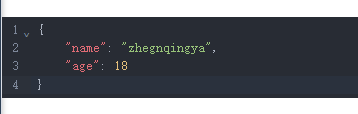
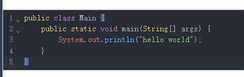

# codemirror6实现高亮代码编辑器

- https://github.com/surmon-china/vue-codemirror
- https://github.surmon.me/vue-codemirror

### 1、安装依赖

```shell
cnpm i vue-codemirror6 codemirror
```

### 2、示例demo

#### 案例一：json

```
cnpm i @codemirror/lang-json
cnpm i @codemirror/theme-one-dar
```

```
<template>
  <div style="margin-top: 100px">
    <codemirror v-model="jsonStr" basic :lang="json()" :extensions="[oneDark]" />
  </div>
</template>
<script setup>
const { proxy } = getCurrentInstance();
import codemirror from 'vue-codemirror6';
import { json } from '@codemirror/lang-json';
import { oneDark } from '@codemirror/theme-one-dark';

let jsonStr = JSON.stringify({ name: 'zhegnqingya', age: 18 }, null, '\t');

onMounted(() => {});
</script>
<style lang="scss" scoped></style>
```



### 案例二：java

```
cnpm i @codemirror/lang-java
cnpm i @codemirror/theme-one-dar
```

```
<template>
  <div style="margin-top: 100px">
    <codemirror v-model="code" basic :extensions="[java(), oneDark]" />
  </div>
</template>
<script setup>
const { proxy } = getCurrentInstance();
import codemirror from 'vue-codemirror6';
import { java } from '@codemirror/lang-java';
import { oneDark } from '@codemirror/theme-one-dark';

let code = `public class Main {
    public static void main(String[] args) {
        System.out.println("hello world");
    }
}`;

onMounted(() => {});
</script>
<style lang="scss" scoped></style>
```


