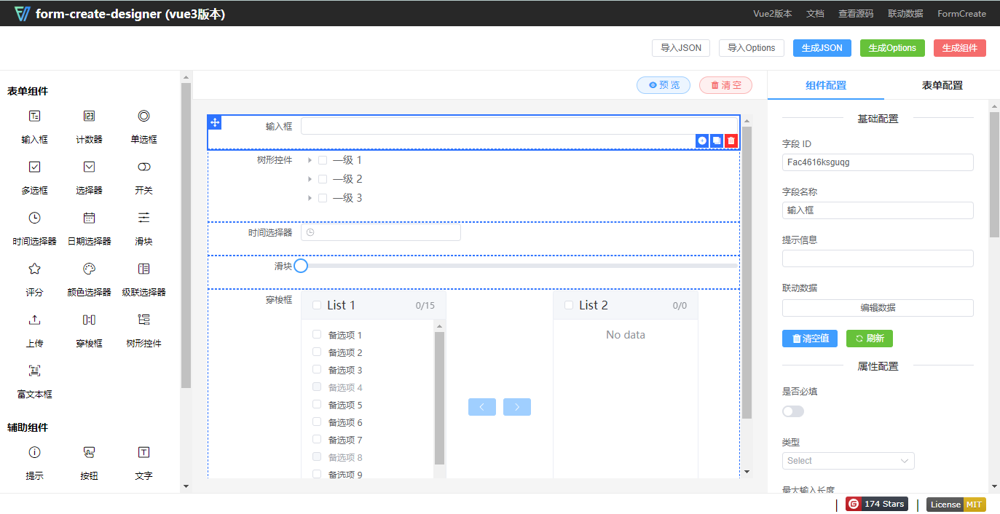
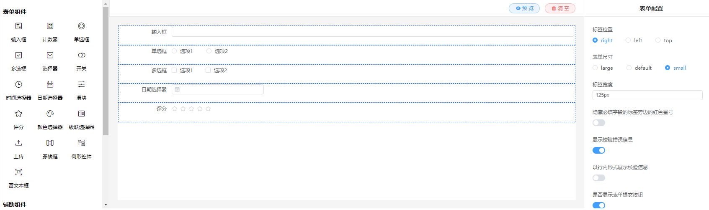

# 表单设计器

### 一、form-create

表单设计器组件

- https://github.com/xaboy/form-create
- https://www.form-create.com/

### 二、form-create-designer

好用的vue可视化表单设计器

- https://github.com/xaboy/form-create-designer
- https://designer.form-create.com/guide/
- https://form-create.com/v3/designer



### 三、示例demo

#### 1、安装依赖

```shell
cnpm i @form-create/designer@next
cnpm i @form-create/element-ui@next
```

#### 2、main.js 配置

```
// 表单设计器
import formCreate from '@form-create/element-ui';
import FcDesigner from '@form-create/designer';
app.use(formCreate);
app.use(FcDesigner);
```

#### 3、demo

```
<template>
  <div style="margin-top: 10px">
    <fc-designer ref="designer" />
  </div>
</template>
<script setup>
const { proxy } = getCurrentInstance();

onMounted(() => {});
</script>
<style lang="scss" scoped></style>
```

效果：


