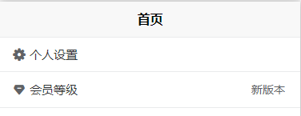

# uview-plus

> tips: 参考 https://uiadmin.net/uview-plus/components/npmSetting.html

### 引入

```shell
cnpm install uview-plus
```

`main.js`

```
// #ifdef VUE3
import {
	createSSRApp
} from 'vue'

import uviewPlus from 'uview-plus'

export function createApp() {
	const app = createSSRApp(App)

	// uview-plus
	app.use(uviewPlus)

	return {
		app
	}
}
// #endif
```

`uni.scss`

```
@import 'uview-plus/theme.scss';
```

`App.vue`

```
/* 注意要写在第一行，同时给style标签加入lang="scss"属性 */
@import "uview-plus/index.scss";
```

### 使用

```
<template>
	<u-cell-group>
		<u-cell icon="setting-fill" title="个人设置"></u-cell>
		<u-cell icon="integral-fill" title="会员等级" value="新版本"></u-cell>
	</u-cell-group>
</template>
```


