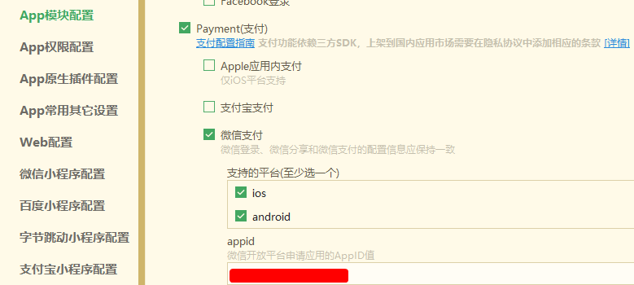

# 微信小程序支付

https://uniapp.dcloud.net.cn/api/plugins/payment.html

### `manifest.json` 配置支付



### uniapp 代码

```
// 可从 wxjava sdk 返回的参数中获取
let payParams = {
    "timeStamp": "xxx",
    "nonceStr": "xxx",
    "wxPackage": "xxx",
    "signType": "xxx",
    "paySign": "xxx",
}

// 使用参考 https://uniapp.dcloud.net.cn/api/plugins/payment.html
uni.requestPayment({
    provider: 'wxpay',
    timeStamp: payParams.timeStamp,
    nonceStr: payParams.nonceStr,
    package: payParams.wxPackage,
    signType: payParams.signType,
    paySign: payParams.paySign,
    success: function(res) {
        console.log('success: ' + JSON.stringify(res));
    },
    fail: function(err) {
        console.log('fail: ' + JSON.stringify(err));
    }
});
```

### java后端代码

```
@SneakyThrows(Exception.class)
public PayOrderCreateVO unifiedOrder(PayOrderCreateDTO params) {
    WxPayService wxPayService = this.wxPayFactory.wxPayService();

    // 1、创建订单
    WxPayUnifiedOrderResult wxPayUnifiedOrderResult = wxPayService.unifiedOrder(
            WxPayUnifiedOrderRequest.newBuilder()
                    .outTradeNo(params.getOrderNo())
                    .openid(params.getOpenId())
                    .totalFee(params.getTotalPrice())
                    .body(params.getOrderDesc())
                    .tradeType("JSAPI")
                    .spbillCreateIp(NetUtil.getLocalhostStr())
                    .notifyUrl(this.notifyHost + "/wx/callback/notify/order/" + params.getTenantId())
                    .build()
    );

    // 2、返回小程序需要的支付参数
    // 小程序调起支付 https://pay.weixin.qq.com/wiki/doc/api/wxa/wxa_api.php?chapter=7_7&index=5
    String nonceStr = RandomUtil.randomString(20);
    String timeStamp = String.valueOf(System.currentTimeMillis() / 1000);
    String wxPackage = "prepay_id=" + wxPayUnifiedOrderResult.getPrepayId();
    String signType = "MD5";
    String paySign = SignUtils.createSign(new HashMap<String, String>(5) {
        {
            this.put("appId", wxPayUnifiedOrderResult.getAppid());
            this.put("timeStamp", timeStamp);
            this.put("nonceStr", nonceStr);
            this.put("package", wxPackage);
            this.put("signType", signType);
        }
    }, "MD5", wxPayService.getConfig().getMchKey(), null);

    return PayOrderCreateVO.builder()
            .nonceStr(nonceStr)
            .wxPackage(wxPackage)
            .timeStamp(timeStamp)
            .signType(signType)
            .paySign(paySign)
            .build();
}
```
