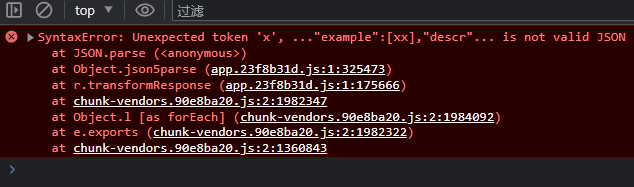
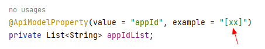

# SyntaxError: Unexpected token 'x', ..."example":[xx],"descr"... is not valid JSON

```
SyntaxError: Unexpected token 'x', ..."example":[xx],"descr"... is not valid JSON
    at JSON.parse (<anonymous>)
    at Object.json5parse (app.23f8b31d.js:1:325473)
    at r.transformResponse (app.23f8b31d.js:1:175666)
    at chunk-vendors.90e8ba20.js:2:1982347
    at Object.l [as forEach] (chunk-vendors.90e8ba20.js:2:1984092)
    at e.exports (chunk-vendors.90e8ba20.js:2:1982322)
    at chunk-vendors.90e8ba20.js:2:1360843
```



问题原因： example 中 `[]` 内容会被识别为JSON格式！导致生成文档时出现问题...

