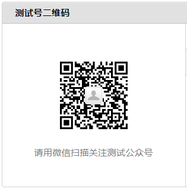
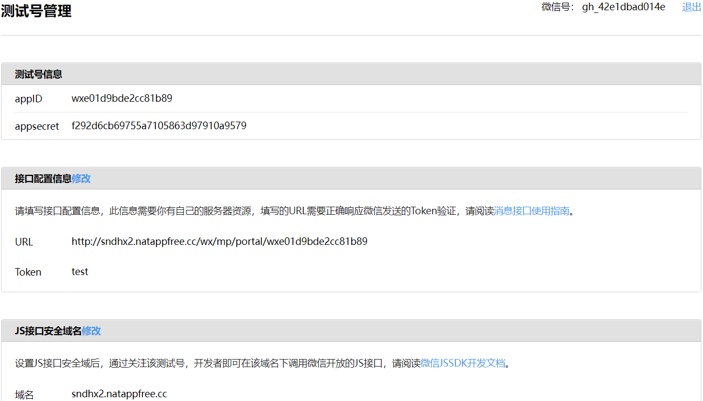
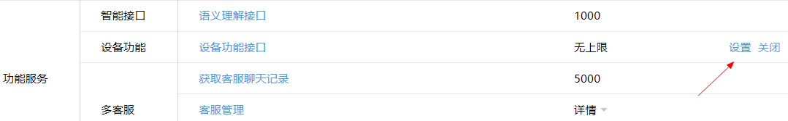
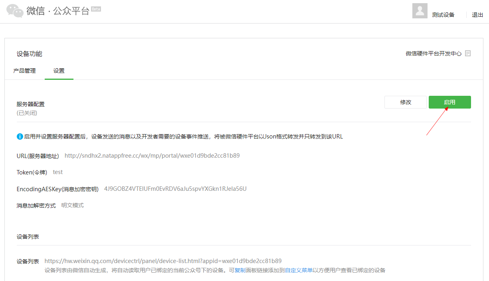

# 测试号

> eg: 我的测试号
> 

### 登录微信公众平台

https://mp.weixin.qq.com

### 公众平台测试账号

`设置与开发` -> `开发者工具` -> `公众平台测试账号`

> tips: 和下面`设置`中的配置保持一致即可。



`功能服务` -> `设备功能` -> `设置`




配置后得到信息如下：

```
公众号名称                 -> 郑清的测试公众号
公众号ID                  -> gh_42e1dbad014e
AppID                    -> wxe01d9bde2cc81b89
AppSecret                -> f292d6cb69755a7105863d97910a9579
Token                    -> test
URL                      -> http://{域名}/wx/mp/portal/{appId}     eg: http://sndhx2.natappfree.cc/wx/mp/portal/wxe01d9bde2cc81b89
EncodingAESKey 或 AesKey -> 4J9GOBZ4VTElUFm0EvRDV6aJu5spvYXGkn1RJela56U
消息加解密方式             -> 明文模式
```

### 问题 `{"errcode":40164,"errmsg":"invalid ip xxx ipv6 ::ffff:xxx, not in whitelist rid: xxx"}`

解决：`设置与开发` -> `安全中心` -> `IP白名单` 中设置调用接口的IP地址

