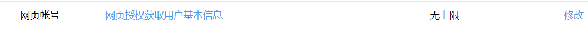
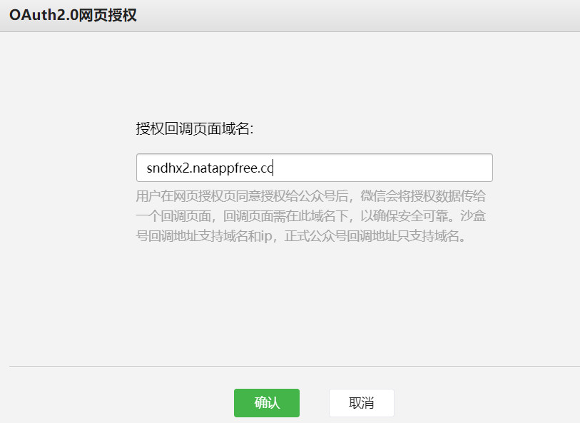

# H5授权登录

> https://developers.weixin.qq.com/doc/offiaccount/OA_Web_Apps/Wechat_webpage_authorization.html

网页授权流程分为四步：

1. 引导用户进入授权页面同意授权，获取code
2. 通过code换取网页授权access_token（与基础支持中的access_token不同）
3. 如果需要，开发者可以刷新网页授权access_token，避免过期
4. 通过网页授权access_token和openid获取用户基本信息（支持UnionID机制）

关于特殊场景下的静默授权

1. snsapi_base为scope的网页授权，静默授权，用户无感知；
2. 对于已关注公众号的用户，如果用户从公众号的会话或者自定义菜单进入本公众号的网页授权页，即使是scope为snsapi_userinfo（原本：需要用户手动同意），也是静默授权，用户无感知。

### 一、准备

> 测试号

`网页服务` -> `网页帐号`




### 二、开发

#### 1、授权链接

https://open.weixin.qq.com/connect/oauth2/authorize?appid=APPID&redirect_uri=REDIRECT_URI&response_type=code&scope=SCOPE&state=STATE#wechat_redirect

>
eg: https://open.weixin.qq.com/connect/oauth2/authorize?appid=wxe01d9bde2cc81b89&redirect_uri=http%3A%2F%2Fsndhx2.natappfree.cc%2Fwx%2Fmp%2Foauth%2Fcallback%2Fwxe01d9bde2cc81b89&response_type=code&scope=snsapi_userinfo&state=STATE&connect_redirect=1#wechat_redirect

#### 2、回调处理

```
WxOAuth2Service oAuth2Service = this.wxMpService.switchoverTo(appId).getOAuth2Service();
WxOAuth2AccessToken wxOAuth2AccessToken = oAuth2Service.getAccessToken(code);
//        String accessToken = wxOAuth2AccessToken.getAccessToken();
//        String openId = wxOAuth2AccessToken.getOpenId();
WxOAuth2UserInfo userInfo = oAuth2Service.getUserInfo(wxOAuth2AccessToken, "zh_CN");
log.info("[微信公众号] 授权回调 用户信息：[{}]", JSONUtil.toJsonStr(userInfo));
```

#### 3、业务处理

拿到用户信息后，就开始做自己系统的业务逻辑处理...

